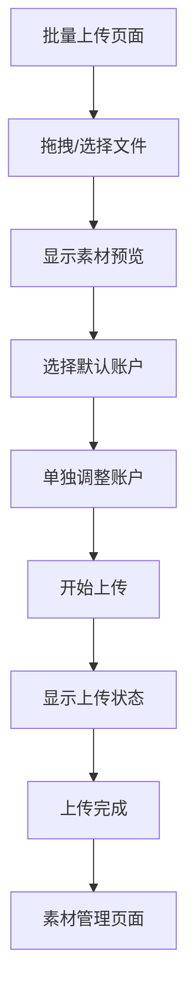

## 1. 产品概述
素材管理系统是一个专为广告主设计的工具，用于批量管理和上传素材到抖音广告账户。系统支持多账户管理，允许用户一次性上传多个素材到不同的广告账户，提高广告投放效率。

## 2. 核心功能

### 2.1 用户角色
| 角色 | 注册方式 | 核心权限 |
|------|----------|----------|
| 广告主 | 手机号/邮箱注册 | 管理广告账户、上传素材、查看上传历史 |
| 子账户 | 主账户邀请 | 使用分配的广告账户、上传素材 |

### 2.2 功能模块
批量上传素材功能包含以下核心页面：
1. **批量上传页面**：拖拽上传区域、素材预览、账户选择、上传状态跟踪
2. **素材管理页面**：已上传素材列表、筛选搜索、批量操作
3. **账户管理页面**：广告账户列表、账户授权管理

### 2.3 页面详情
| 页面名称 | 模块名称 | 功能描述 |
|----------|----------|----------|
| 批量上传页面 | 上传区域 | 支持拖拽和点击选择文件，支持批量选择图片/视频文件，实时显示上传进度 |
| 批量上传页面 | 素材预览 | 网格/列表视图切换，显示素材缩略图、文件名、文件大小、格式信息 |
| 批量上传页面 | 账户选择 | 全局账户选择器（默认应用到所有素材），单个素材账户选择器（可覆盖全局设置） |
| 批量上传页面 | 上传状态 | 实时显示每个素材的上传进度、成功/失败状态，支持重试失败的上传 |
| 素材管理页面 | 素材列表 | 展示所有已上传素材，支持按账户、时间、类型筛选，支持关键词搜索 |
| 账户管理页面 | 账户列表 | 显示已授权的广告账户，支持添加/删除账户，显示账户状态 |

### 2.4 核心流程
用户批量上传素材的操作流程：
1. 用户进入批量上传页面
2. 拖拽或选择多个素材文件到上传区域
3. 系统显示素材预览列表
4. 用户选择默认广告账户（全局设置）
5. 用户可为特定素材单独选择不同账户（可选）
6. 点击开始上传，系统批量处理
7. 实时显示上传进度和状态
8. 上传完成后显示结果汇总

## 3. 用户界面设计

### 3.1 设计风格
- **主色调**：蓝色系（#1890ff），体现专业和可信赖
- **辅助色**：绿色（#52c41a）表示成功，红色（#ff4d4f）表示失败
- **按钮样式**：圆角矩形，主要操作为实心按钮，次要操作为边框按钮
- **字体**：系统默认字体，主要文字14-16px，标题18-24px
- **布局风格**：卡片式布局，左侧功能区域，右侧预览区域
- **图标风格**：线性图标，简洁明了

### 3.2 页面设计概览
| 页面名称 | 模块名称 | UI元素 |
|----------|----------|--------|
| 批量上传页面 | 上传区域 | 虚线边框的拖拽区域，中央显示上传图标和提示文字，支持多文件同时拖拽 |
| 批量上传页面 | 素材预览 | 网格布局显示缩略图，每个素材卡片包含预览图、文件名、文件信息、账户选择下拉框 |
| 批量上传页面 | 账户选择 | 顶部全局账户选择器，每个素材卡片内的独立账户选择器，支持下拉搜索 |
| 批量上传页面 | 上传状态 | 进度条显示上传百分比，状态图标（加载中/成功/失败），失败原因提示 |
| 素材管理页面 | 素材列表 | 表格形式展示，包含缩略图、文件名、所属账户、上传时间、状态等列 |

### 3.3 响应式设计
- **桌面端优先**：默认设计为桌面端使用，充分利用屏幕空间
- **平板适配**：支持1024px以上屏幕，保持核心功能完整
- **移动端简化**：移动端仅提供素材查看和简单管理功能

### 3.4 交互细节
- **拖拽反馈**：拖拽时上传区域高亮显示，支持拖拽多个文件
- **实时预览**：图片素材显示缩略图，视频素材显示首帧预览
- **批量操作**：支持全选/反选，批量应用账户设置
- **错误处理**：上传失败时显示具体原因，支持单个文件重试
- **加载状态**：上传过程中显示进度条和预计剩余时间